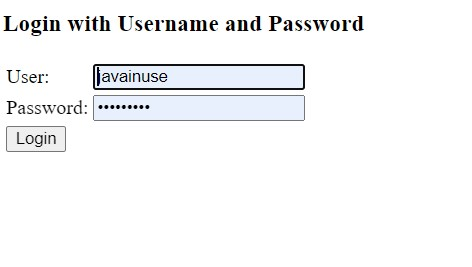
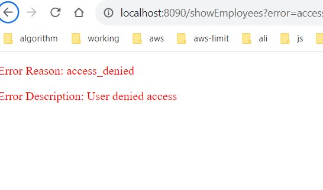

There are legacy JDK issue. So client works in JDK  17 but server needs JDK 11

First opne http://localhost:8090/getEmployees  

it will have prefilled form. When submitted it will ask username and password 

Username: javainuse
Password: javainuse

Then there will be OAuth Approval page. If approved then it will fetch data by the secret API /user/getEmployeesList 

If Deny then it will show the reason in an error page. 

